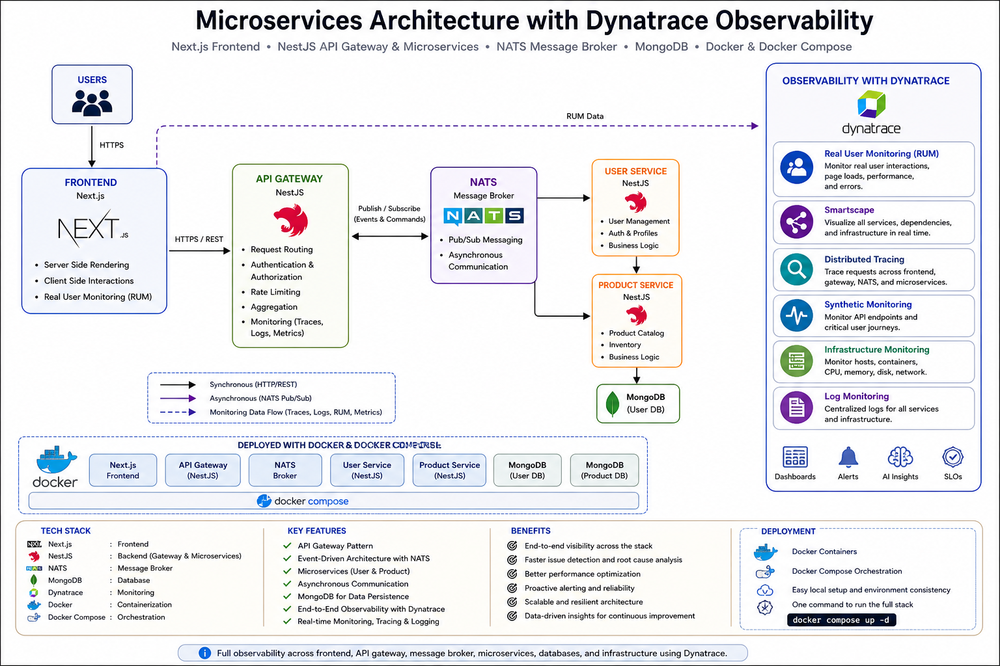

# 📦 Microservices Architecture with Dynatrace Observability

## 🧭 Overview

This project demonstrates a production-style microservices architecture deployed on an AWS EC2 environment using Docker containers. The platform consists of independently deployable backend services, a frontend application, event-driven communication through NATS messaging, and persistent data storage with MongoDB.

The architecture is designed to showcase modern cloud-native application patterns, including service isolation, asynchronous communication, centralized observability, and scalable deployment practices.

## 

## 🚀 Deployment & Monitoring

After the CI/CD pipeline execution is completed successfully, the application will be accessible at:

**Application URL:** `https://github.com/Badhon58/FullStackMicroservice/tree/main`

### Dynatrace Verification

Once the application is running, perform the following monitoring activities in Dynatrace:

- Verify service discovery in Smartscape
- Analyze distributed traces across microservices
- Monitor infrastructure metrics (CPU, Memory, Network)
- Review centralized logs
- Validate Real User Monitoring (RUM) data
- Execute Synthetic Monitoring checks
- Identify performance bottlenecks and service dependencies

This ensures that the deployed application is functioning correctly and all observability components are reporting data to Dynatrace.

---

## Set Up the Microservices Project
kacaj81543@aratrin.com
Kacaj81543@aratrin.com